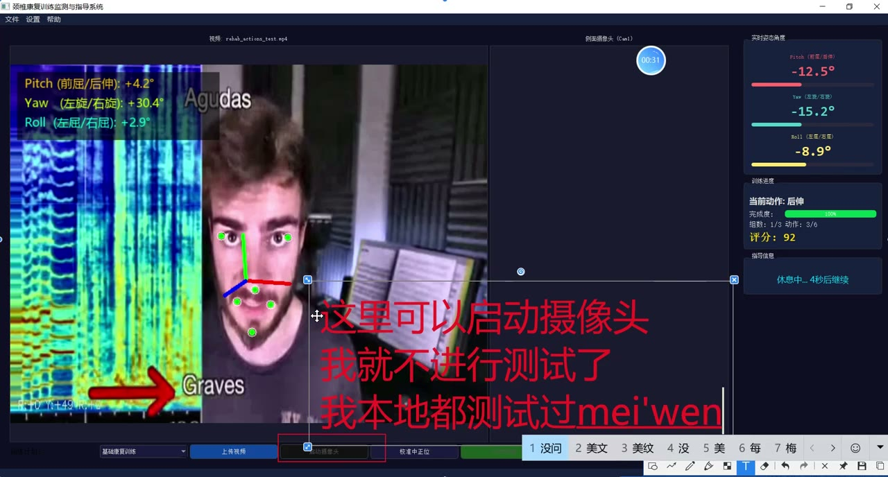
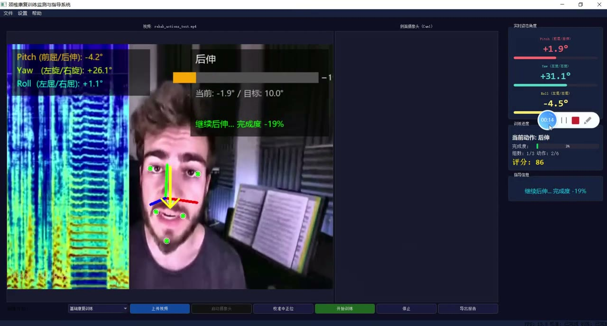
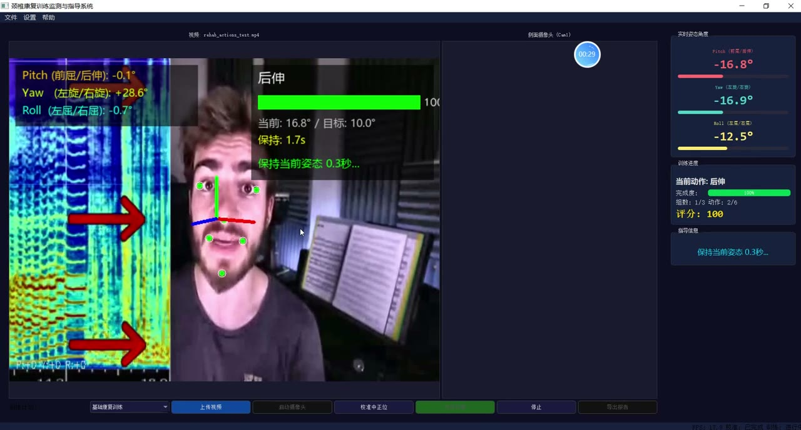
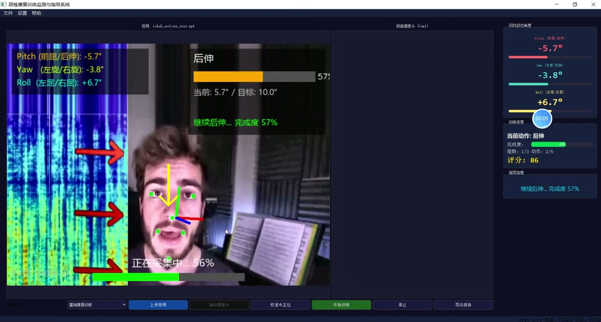
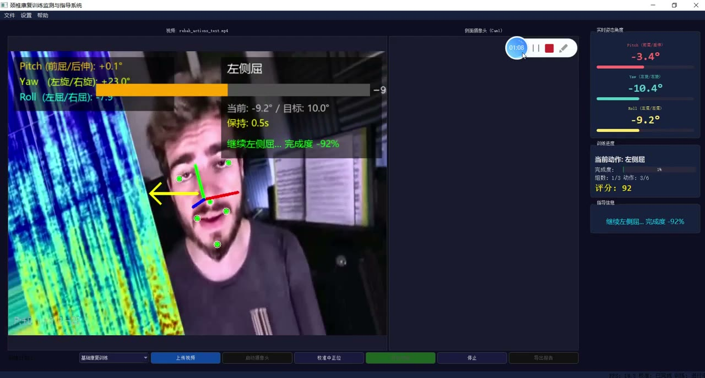
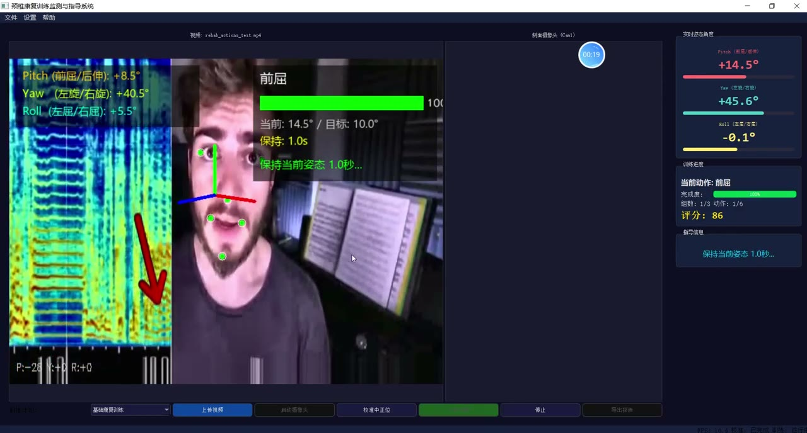

# (附文档)Python+PyQt+深度学习 基于头部姿态识别的颈椎康复训练监测与指导系统

**技术栈**：Python、PyQt5

### 系统简介

本系统基于 Python 与 PyQt5 构建，采用前后端分离思路，通过摄像头或视频文件实时采集人脸图像，利用头部姿态识别算法计算俯仰角、偏航角与滚转角，对颈椎康复训练动作进行实时监测与可视化指导。系统包含普通用户端与管理配置端两类角色，支持训练计划配置、姿态平滑滤波、三维坐标轴投影与训练过程可视化反馈。
 
### 核心功能
 
### 普通用户端

- 启动 GUI 主窗口，加载 PyQt5 界面并自动读取摄像头或指定视频文件作为输入源。

- 实时人脸检测，基于 MediaPipe 检测人脸关键点并提取 PnP 二维特征点。

- 头部姿态估计，通过 PnP 算法计算旋转向量与平移向量，输出俯仰角、偏航角、滚转角。

- 姿态数据平滑，使用滑动窗口均值对 pitch、yaw、roll 进行滤波，减少抖动。

- 三维坐标轴投影，将头部姿态的 rvec/tvec 投影到图像平面并绘制坐标轴指示方向。

- 实时画面叠加渲染，在视频帧上绘制人脸框、姿态角度数值与坐标轴。

- 训练过程控制，支持按空格键暂停或继续训练画面。

- 滤波器重置，按 R 键重置平滑滤波器与姿态估计器状态。

- 视频文件播放进度显示，在画面底部绘制进度条并支持播完自动重播。

- 退出演示，按 Q 键关闭窗口并释放摄像头与检测器资源。
 
### 管理员端

- 加载系统配置文件，通过 ConfigLoader 读取 settings.yaml 中的摄像头宽度、高度等参数。

- 加载训练计划配置，读取 training_plans.yaml 中的康复训练计划内容。

- 支持按点分路径读取配置项，如 camera.width、camera.height 等键值。

- 日志管理，自动创建 logs 目录并按日期生成日志文件。

- 日志分级输出，同时输出到控制台与文件，格式包含时间、级别、模块与消息。

- 单例配置加载，保证全局配置实例唯一，避免重复读取文件。

- 命令行参数解析，支持 -- 演示模式与 --video 指定视频文件路径。

- 相机内参估算，在无标定数据时按图像宽度估算焦距与主点坐标。
 
### 技术栈

开发语言Python
界面框架PyQt5
计算机视觉OpenCV
人脸检测MediaPipe
数值计算NumPy
配置管理YAML
日志模块logging
姿态算法PnP 求解、旋转矩阵与欧拉角转换
 
### 交付内容

- 后端完整源码

- 前端完整源码

- 数据库初始化脚本

- 万字文档

## 界面展示

---

## 获取完整源码 + 万字文档

本仓库为项目介绍页。**完整前后端源码、数据库初始化脚本、万字项目文档**，请加微信 `kangkangcode`，或访问 [codekk.top](http://codekk.top) 获取。

可作课程设计 / 毕业设计参考，支持远程部署调试。